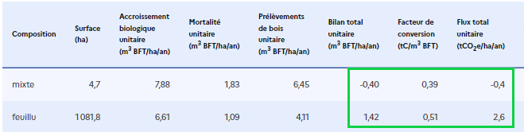

# ❔ FAQ ALDO

## Définition

Pourquoi les stocks de carbone sont mesurés en tC et les flux de carbone en tCO2e ?

Par convention les stocks de carbone dans les sols et biomasse sont en tC.

Les flux d'émissions ou de séquestration sont exprimés en équivalent CO2 : tCO2eq.&#x20;

**1tCO2 = 44/12 tC.**

Pour plus de détails, se référer [aux définitions des stocks et des flux.](../introduction/definitions.md#flux-de-carbone)

Pourquoi lors d'un changement d'occupation des sols, le flux de carbone destocké peut être supérieur au carbone précédemment stocké ?

La valeur du flux n'est pas supérieur à proprement parlé, il faut regarder l'unité.

Tant que le carbone est dans le sol, il s’agit physiquement de molécule de carbone ( C ). Quand le carbone se retrouve dans l’atmosphère (ici via le changement d’occupation du sol que vous mentionnez), il s’agit de dioxyde de carbone (CO2), il y a donc un rapport \*44/12 entre les 2. Ainsi, un flux généré par un changement d'affectation des sols se calcul comme suit : Flux (en tC/ha) = (Stock initial - Stock final) \* 44/12.

Pour plus de détails, se référer [aux définitions des stocks et des flux.](../introduction/definitions.md#flux-de-carbone)

***

## Utilisation de l'outil ALDO

Comment extraire mes données au format Excel depuis l'outil Aldo ?

Une fois que vous avez renseigné le nom de votre EPCI, une page charge avec un bouton 'Télécharger en format Excel' en haut à droite de votre page. Cela vous permettra de récupérer la liste des communes de votre ECPI ainsi que les données de stock et de flux carbone associées à celui-ci.

.png>)

Comment trouver le nom de mon EPCI ?

Le maillage administratif utilisé est celui de 2018, comme [préciser dans les sources ](../introduction/sources.md#maillage-administratif-1)(disponible au téléchargement). Le nom des communes/EPCI peut avoir changer depuis 2018. Il faut donc chercher le nom effectif en 2018.

Pour plus d'informations, se référer à la [section dédiée.](../configuration/configuration-manuelle.md#agregation-de-communes)

Comment accéder au code source de l'outil ALDO ?

Le code source [est accessible ici](https://github.com/incubateur-ademe/aldo).

L'outil étant complétement ouvert, les contributions et retours sont les bienvenus.

Est-il possible de s'interfacer à ALDO ?

Il est tout à fait possible de s'interfacer à ALDO.

L'agrégation de la base de données ALDO est exportable en csv.

Pour de plus amples détails - contacter l'équipe ALDO pour échanger techniquement. Attention à l'échelle d'utilisation des résultats si elle est inférieure à l'EPCI.

Est-ce que l'ancienne version ALDO au format Excel est encore téléchargeable ?

La version excel n'est plus téléchargeable car n'a pas fait l'objet des dernières corrections et mises à jour. En cas de besoin spécifique prendre contact avec notre équipe.

***

## Utilisation des résultats ALDO et périmètre d'application

L'application de la méthode au niveau du territoire d'une commune est-elle pertinente ?

Il s'agit selon l'avis du comité scientifique d'une limite de précision des données d'entrée (notamment sols et forêts). Les échelles supra-communales sont pertinentes.

ALDO permet-il d'établir un suivi de la séquestration carbone d'année en année ?

ALDO ne permet pas pour le moment de suivre l'évolution annuelle de la séquestration carbone. Plus de détails [ici](https://aldo-documentation.territoiresentransitions.fr/aldo-documentation/complements/perimetre-et-limites#dynamique-du-carbone-des-sols).

Par exemple pour les données d'occupation du sol : la dernière campagne CORINE LAND COVER présente l'évolution entre 2012 et 2018. La prochaine campagne sera donc entre 2018 et 2024.

A noter que l'inventaire CITEPA, une nouvelle base de données, remplacera en 2024 celles utilisées actuellement dans ALDO (et qui ne sont pas actualisées chaque année). L'inventaire CITEPA sera annualisé et tiendra donc compte de la dynamique carbone dans les sols.

Est-ce qu'ALDO peut être utilisé par une entreprise ou une activité ?

L'outil ALDO donne des ordres de grandeur mais n'est pas utilisable à une échelle infra-communale type parcellaire / opérationnelle, pour des projets de gestion, d'aménagement (exemple une exploitation agricole, golf, exploitation forestière), etc…

ALDO permet-il d'avoir des données sur les micro-forêts ?

L'échelle d'ALDO est supra-communale - a priori les micro-forêts ne sont pas dans ce spectre (plus fin). Les surfaces de renaturation peuvent être renseignées manuellement, au titre des sols artificiels arbustifs ou arborés par exemple.

Est-ce que les données du stockage de carbone dans l'eau seront prises en compte dans l'outil ALDO à terme ?

Il n'est pas prévu pour ALDO d'intégrer l'estimation de "carbone bleu" des écosystèmes aquatiques voire des flux liés au milieu marin. Cela reste un champ d'étude avec peu de référence actuellement, et pas d'outil à notre connaissance.

L'outil ALDO prend-il en compte les émissions indirectes, comme les émissions liées à la fabrication des intrants ?

L'inventaire CITEPA prend en compte les émissions indirectes des activités dans les volets sectoriels industrie, agriculture, et non dans le volet secteur utilisation des terres, changement d'affectation des terres et forêts (UTCATF). C'est la même chose pour ALDO.

Est-ce que ALDO est utilisé en appui pour réaliser des études de compensation carbone ?

Non, ALDO ne doit pas être utilisé pour des démarches de compensation carbone car les résultats ne sont pertinents qu'à l'échelle supra-communale, et non à l'échelle de parcelle agricole ou d'unité de gestion forestière. La compensation carbone doit s'appuyer sur des outils spécifiques (cf le cadre de méthodes Label Bas Carbone)

ALDO est-il adaptable au contexte des forêts équatoriales ?

Aujourd’hui, les données relatives aux forêts équatoriales sur des territoires à l'[internationa](https://aldo-documentation.territoiresentransitions.fr/aldo-documentation/complements/perimetre-et-limites#international)l ne sont pas disponibles dans l’outil ALDO. Une réflexion est en cours pour intégrer les territoires français d'[outre-mer.](https://aldo-documentation.territoiresentransitions.fr/aldo-documentation/complements/perimetre-et-limites#dom-com)

Quel outil faut-il utiliser pour faire des évaluation au niveau local si ALDO n'est pas pertinent pour cette échelle?

Pour des projets de séquestration de carbone il faut se référer aux outils et méthodes sectorielles type Label Bas Carbone (méthodes forestières et agricoles), pour évaluer le gain de stockage d'un projet par rapport à un scénario de référence.

***

## Documentation

Dans quels documents peut-on trouver des données locales plus précises sur les surfaces ?

Les agences d'urbanisme peuvent publier des données d'occupation des sols mises à jour régulièrement (exemple : MOS de l'institut Paris Région). L'Observatoire de l'artificialisation des sols (CEREMA) peut affiner les surfaces mais spécifiquement sur l'artificialisation donc ne couvrant pas l'intégralité de chaque territoire. On trouve également des démarches en cours sur l'occupation des sols à grande échelle (OCS GE), et l'intégration des enquêtes TERUTI.

Les données des points d’inventaire forestier sont elles disponibles et si oui, comment les obtenir ?

Les données brutes de l'IFN sont téléchargeables [ici](https://inventaire-forestier.ign.fr/dataIFN/) (sous certaines restrictions).

Y a-t-il une norme (internationale) sur la façon de comptabiliser les produits bois ? Production ou consommation ?

Les lignes directrices du GIEC (2006 - vol 4 ) présentent les normes méthodologiques pour les approches production et consommation.

Dans ALDO, comme expliqué [ici ](https://aldo-documentation.territoiresentransitions.fr/aldo-documentation/configuration/configuration-manuelle#hypothese-de-calcul-des-produits-bois): L’hypothèse "production" (récolte) est privilégiée pour garder le lien avec les forêts du territoire. En effet, les mécanismes de stockage de carbone dans les produits bois sont interconnectés avec les variations de stocks dans les forêts. Ces mécanismes doivent donc être évalués conjointement.&#x20;

Comment sont calculés les stocks de carbone de références utilisés par l'outil ?

Les sources sont consultables [ici.](https://aldo-documentation.territoiresentransitions.fr/aldo-documentation/introduction/sources#stocks-de-carbone-de-reference-tc-ha)

Dans ALDO, le jeu de données RMQS a été utilisé, soit 1 point de mesure dans chaque maille de 16km. Un traitement statistique a été fait par GIS SOL pour donner des valeurs par zone pédoclimatique et par occupation du sol. Ensuite, chaque EPCI se voit attribuer une ZPC majoritaire, ce qui permet de ventiler les résultats pour chaque EPCI selon les ZPC pour chaque occupation du sol.

***

## Interprétation des résultats

Lorsque la valeur d'un coefficient évolue d'une version d'ALDO à une autre, comment savoir si l'évolution est due à une variation intrinsèque du coefficient ou si c'est due à une évolution méthodologique ?

Entre les versions EXCEL (2021), et digitales (HETRE 2022 et CHANTERELLE 2023), si des évolutions du coefficient constatées (on parle donc des données carbone à l'hectare) :

* du sol, ce sera une évolution méthodologique (les coefficients par zone pédoclimatique par occupation du sol restent les mêmes, simplement lors du passage de l'échelle EPCI à commune, les communes pourront avoir une ZPC différente de l'EPCI)
* des haies, ce sera une évolution méthodologique aussi (la source change pour utiliser l'étude IGN 2022)
* de la forêt, il s'agira majoritairement d'une évolution du coefficient (actualisation de l'inventaire forestier IGN). Il pourra également y avoir des cas où comme le sol, la commune ne sera pas majoritairement dans la même zone sylvicole que l'EPCI, mais ça sera très rare. Attention toutefois : ALDO ne doit pas être utilisé pour tracer des tendances, il s'agit d'une résultat ponctuel : certaines données sont actualisées (forêts), d'autres ne l'ont jamais été (haies, sols, par exemple).

Quelle est l'année à indiquer avec les données affichées dans l'outil ALDO ?

L'année est bien précisée : exemple onglet flux : Bases de changement CLC 2012 2018 & Inventaire forestier IGN 2012 2016. Pour les résultats rétrospectifs, attention toutefois : ALDO ne doit pas être utilisé pour tracer des tendances, il s'agit d'un résultat ponctuel : certaines données sources sont actualisées (forêts), d'autres ne l'ont jamais été (haies, sols, par exemple).

Pourquoi les stocks de référence varient-ils selon le territoire? (par exemple les prairies herbacées) ?

Les stocks de référence des sols de prairie varient selon la zone pédoclimatique : le type de sol et le climat influencent la capacité du sol à stocker de la matière organique. Les valeurs de référence issues du RMQS sont définies par zone pédoclimatique et par occupation du sol.

Pourquoi le facteur de conversation ne donne pas une correspondance exacte entre volume et carbone ?

Concernant les flux annuels liés à l'accroissement net de la biomasse en forêts, comme vous l'aurez peut-être constaté, le flux total unitaire (tCO2e/ha/an) n'est pas l'exact multiplication du bilan total unitaire (m3 BFT/ha/an) par le facteur de conversion (tC/m3 BFT) et le [ratio](https://aldo-documentation.territoiresentransitions.fr/aldo-documentation/faq/faq-aldo#pourquoi-les-stocks-de-carbone-sont-mesures-en-tc-et-les-flux-de-carbone-en-tco2e) de tCO2e/tC.

Dans l'exemple ci-dessous, pour les forêts mixtes, la multiplication des -0,40 m3 BFT/ha/an par 0,39 tC/m3 BFT et par 44/12 tCO2e/tC ne donne pas précisément -0,40 tCO2e/ha/an mais une valeur proche (-0,57 tCO2e/ha/an).

Pourquoi ?

L'ensemble des ces données proviennent de l'[inventaire forestier de l'IGN](https://aldo-documentation.territoiresentransitions.fr/aldo-documentation/introduction/sources#flux-de-carbone-de-la-biomasse-en-forets-par-accroissement-biologique-net).&#x20;

Le **facteur d'expansion** renseigné permet de passer du volume bois fort tige IFN au stock de carbone aérien et racinaire dans la biomasse ligneuse. Il est le ratio entre la valeur de carbone aérien et racinaire (tC) et le volume bois-fort tige (m3 BFT).

Il ne permet pas de passer du bilan annuel volume (bilan total unitaire en m3 BFT/ha/an) au bilan annuel carbone (flux total unitaire en tCO2e/ha/an) de manière exacte, ces derniers faisant intervenir des calculs intermédiaires pour différentes composantes de flux (mortalité, prélèvements, production) et plusieurs années.

Cependant, ce ratio bilan carbone/bilan volume doit donner des valeurs proches.

Les données d’observatoire sont souvent divergentes avec les données issues d’ALDO, est-il prévu de faire converger les méthodes ?

Une réflexion est en cours pour faire converger avec le travail du CITEPA sur le maillage plus fin et plus actualisé sur les changements d'occupation des sols.

Si un type de sol présente un petit stock de carbone et qu'on ne le retrouve pas du tout dans les flux de CO2e, comment interpréter cette information ? Le stock est stable et la partie émission et séquestration s'équilibre sur l'année ?

Un stock (même faible) sera à l'équilibre si pas de changement d'usage ni de gestion depuis plusieurs années, c'est-à-dire un flux nul. Les changements d'occupation sont évalués dans ALDO par la comparaison des données CORINE LAND COVER 2012 et 2018 (prochain millésime 2024), ils peuvent être affinés par des données locales de type mode d'occupation des sols des agences d'urbanisme.

Pourquoi est-ce qu'il n'y a pas de flux de stockage pour les prairies et les cultures?

Quand il y a un changement vers les surfaces prairies et cultures dans les données, les flux sont bien affichés. Par exemple : [CC Sarrebourg Moselle Sud](https://aldo-carbone.ademe.fr/epci/200068146)

S'il n'y a pas de changement d'usage (artificialisation, ...) ou de nouvelle pratique, on considère qu'il n'y a pas de stockage ou de déstockage sur ces sols. Une réflexion est en cours pour intégrer des valeurs de stockage ou de déstockage tendanciel pour les sols de cultures, prairies permanentes et forêts. Dans tous les cas, ces valeurs sont très faibles comparées aux flux de biomasse forestière ou liés aux changements d'occupation des sols par exemple (les sols de prairie et forêt sont légèrement stockants, les sols de cultures sont légèrement destockants).

Pour utiliser les résultats tirés d'ALDO, faut-il préciser une marge d'erreur ?

Oui, une incertitude existe sur les données d'ALDO, mais cette marge d'erreur est difficile à estimer car il y a une agrégation de plusieurs sources de données et calculs, mais cela fait partie des réflexions, notamment sur les données de carbone des sols qui sont souvent très variables.

Quelle est l'ampleur de l'incertitude sur la période de conversion du stock, quand il y a changement d'occupation ?

La durée de 20 ans appliquée est la durée par défaut préconisée par les lignes directrices du GIEC. Dans les faits, les mesures de terrain montrent que cette valeur peut être bien différente en particulier pour les sols, certains modèles prennent en compte d'autres valeurs (ex. 30 ans). Pour le calcul de l'inventaire, ce qui compte reste le flux de transition d'un stock à un autre. Nos méthodes sur l'estimation de ces flux liés aux conversions ont aussi évolué (voir prochain rapport Ominea du CITEPA à paraître)

Les produits du bois sont perçus comme pouvant séquestrer du C. Pourtant ils se décomposent selon le type de produit et sa longévité. Pourquoi attribuer à ce réservoir une capacité de séquestration?

Il ne s'agit pas d'une "séquestration" physique mais d'un différentiel entre les nouveaux produits bois entrant chaque année (faisant grandir le stock en place du carbone stocké temporairement dans les produits bois) et les produits en fin de vie cette année - ceci étant basé sur une estimation de la cinétique de fin de vie, conformément aux lignes directrices du GIEC pour les inventaires nationaux.

Si le stock annuel diminue pour faire du bois énergie, est-ce un problème ?

Les objectifs nationaux bas carbone (SNBC à l'horizon 2050) reposent sur un développement de filière bois-énergie (effet de substitution des énergies fossiles) mais aussi un maintien du puits de carbone forestier, et une hausse des produits bois notamment bois d'œuvre. Une hausse trop forte ou brutale de taux de prélèvement forestier engendrerait à court et moyen terme un bilan GES globalement défavorable.

***

## Divers

### Zones humides

Comment sont calculés les stocks de carbone des zones humides ?

Comme les autres stocks des autres catégories, les stocks des zones humides proviennent du RMQS, même si l'incertitude est plus forte car elles ne concernent que peu de points de mesure.

Pourquoi les flux carbone au niveau des zones humides sont-ils considérés comme nuls ?

Les stocks de carbone de zones humides sont élevés. Ils peuvent être à l'équilibre (flux nul) ou non (émission en cas d'artificialisation par exemple). Nous n'avons pas de références de stocks de carbone permettant de distinguer la diversité des zones humides, ni l'évolution tendancielle sans changement de surface et d'usage. Le cas échéant ces flux tendanciels sont faibles comparés à ceux engendrés par les changements d'occupation des sols. Conformément aux conventions des inventaires nous considérons qu'à l'échelle de quelques années il n'y a pas de flux pour une zone humide à surface équivalente et sans changement.

Dans le cas d'une artificialisation d'une zone humide, peut-on estimer la perte en CO2 ? Si oui pourquoi ces éléments ne figurent pas dans les projets d'urbanisation ?

Dans les projets d'urbanisation ce sont principalement les impacts sur les surfaces et fonctionnalités de zone humide d'une part, sur les habitats et espèces protégées d'autre part, qui sont considérés (séquence ERC) ; encore insuffisamment les impacts sur le carbone du sol.

***
