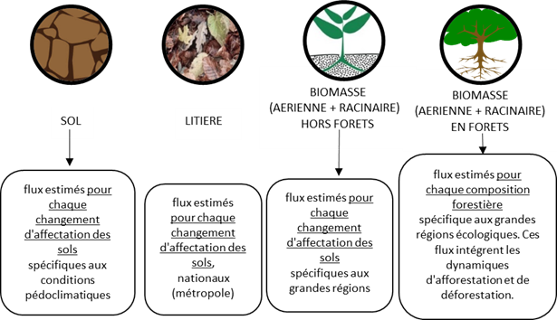

# 📊 Méthode générale

En préambule, consultez la définition d'un [flux](/broken/pages/UPj9ly0Mz7vzCiQ7MyT9) de carbone.

**La rubrique présente ici la méthode générale utilisée dans l'outil ALDO, étape par étape.** Des spécificités sont relatives à certaines typologies dans des rubriques dédiées :&#x20;

* [Spécificités - Forêts et Haies](specificites-forets-et-haies.md)
* [Spécificités - Produits bois](specificites-produits-bois.md)

Toute variation négative ou positive des stocks de carbone, même relativement faible, peut influer sur les concentrations de gaz à effet de serre dans l’atmosphère (en jouant un rôle de source ou de puits de carbone).&#x20;

:heavy\_minus\_sign: Une valeur négative correspond à un déstockage (émission nette de carbone vers l'atmosphère)

:heavy\_plus\_sign: Une valeur positive à un stockage (séquestration nette). Soit un flux net positif de l’atmosphère vers ces réservoirs qui se traduit au final par une diminution du CO2 atmosphérique.

## :one: Collecte des flux de référence unitaires (tC∙ha-1∙an-1 ou tC∙ha-1 ) par réservoir de carbone

Des approches différentes d'estimations des flux de carbone **unitaires** pour chaque réservoir :

### Approche :a:

Pour le **réservoir** du carbone du **sol**, la **litière,** et la **biomasse hors forêt :**

> [Réservoir](../introduction/definitions.md#reservoirs) ALDO -> Sols
>
> [Occupation du sol](../introduction/definitions.md#typologies-doccupation-du-sol) -> Toutes

> [Réservoir](../introduction/definitions.md#reservoirs) ALDO -> Litière
>
> [Occupation du sol](../introduction/definitions.md#typologies-doccupation-du-sol) -> Forêts

> [Réservoir](../introduction/definitions.md#reservoirs) ALDO -> Biomasse
>
> [Occupation du sol](../introduction/definitions.md#typologies-doccupation-du-sol) -> Toutes hors forêts

Pour ces réservoirs, les flux de carbone sont liés à des changement d’occupations des sols. Un flux de carbone de référence pour le sol, la litière et la biomasse hors forêt est associé à chaque changement d’occupation de sol considéré. Ce flux de carbone de référence est une variation de stock en _tonnes de carbone_ entre une occupation du sol initiale et une occupation du sol finale _par hectare_ pour les stockages et déstockages immédiats, et _par hectare et par an_ pour les stockages et déstockages progressifs.


**Le saviez vous ?**

Les flux de stockage de carbone des sols mis à disposition ont été déterminés en considérant que les dynamiques de stockage et de déstockage de carbone sont asymétriques. Selon les [travaux](../complements/bibliographie.md) d'Arrouays et al. 2002, les sols déstockent beaucoup plus vite qu'ils ne stockent.

Aussi, après un changement d'affectation des sols, les sols ne (dé)stockent pas de façon linéaire : un stock dit "à l'équilibre" est  atteint au bout d'un siècle environ.


Pour les changements générant l'atteinte rapide d'un équilibre, par exemple l'artificialisation des sols, la suppression de biomasse, ... le flux unitaire annuel est considéré instantané (1 an) et appliqué l'année du changement d'occupation du sol et correspond à la différence entre le stock état final et le stock état initial.

Pour les changements dont la cinétique est plus lente, tel que les conversions de sols de culture, prairie, forêt (graphique ci-dessus), l'accroissement de biomasse, ... un traitement ADEME a été effectué pour considérer la variation de stock concernée par les 20 dernières années. Le flux unitaire annuel (tCO2e/ha/an) est appliqué et étalé sur 20 ans. Les flux associés à des changements d'occupation des sols récents (<20 ans) ne permettent pas dans ce cas d'atteindre l'équilibre du stock de référence de l'état final. Ce facteur permet de tenir compte des flux de carbone des terres ayant été converties les 20 dernières années mais qui continuent à émettre/séquestrer du carbone.

Ces flux de référence unitaires associés à chaque changement d'occupation considéré, sont multipliés par les variations de surfaces associées, voir section :two:.

### Approche :b:

Pour le **réservoir** du carbone de la **biomasse forestière** :&#x20;

> [Réservoir](../introduction/definitions.md#reservoirs) ALDO -> Biomasse
>
> [Occupation du sol](../introduction/definitions.md#typologies-doccupation-du-sol) -> Forêts

Les flux de référence sont calculés en soustrayant à la production biologique des forêts, la mortalité et les prélèvements de bois.

Les flux de référence unitaires (tC∙ha-1∙an-1) sont associés à chaque composition forestière et régions écologiques. Ces données sources donnent une évolution du volume de bois sur le territoire par composition forestière, incluant donc les dynamiques de croissance sans changement d’occupation des sols (augmentation en volume des forêts sur une surface fixe).

Ils n'incluent pas les dynamiques d’afforestation et déforestation (augmentation/réduction en surface de l'étendue des forêts) qui sont prises en compte avec l'approche :a: **-> Plus de détails** dans la rubrique dédiée [Spécificités - Forêts et Haies](specificites-forets-et-haies.md)

D’un point de vue pratique, les flux totaux de ce réservoir sont ainsi calculés en multipliant chaque facteur de référence par la surface des compositions forestières associées, voir section :two:.

### Sources pour :a: et :b:

<figure><figcaption></figcaption></figure>

* **Sol** - Flux estimés pour chaque changement d'affectation des sols. Les flux de référence sont spécifiques aux conditions pédoclimatiques : [sources.](../introduction/sources.md#flux-de-carbone-de-reference-tco2e-ha-an)
* **Litière** - flux estimés pour chaque changement d'affectation des sols. Les flux de référence sont une moyenne nationale (métropole) : [sources.](../introduction/sources.md#flux-de-carbone-de-reference-tco2e-ha-an)
* **Biomasse hors forêts** - flux estimés pour chaque changement d'affectation des sols. Les flux de référence sont spécifiques aux grandes régions : [sources.](../introduction/sources.md#flux-de-carbone-de-reference-tco2e-ha-an)
* **Biomasse en forêts -**&#x20;
  * flux liés à l'accroissement net des végétaux, en intégrant les flux liés à une augmentation de la surface de forêts et à l'accroissement en volume des forêts existantes. Ces flux sont estimés pour chaque composition forestière. Les flux de référence sont spécifiques aux régions écologiques : [sources.](../introduction/sources.md#flux-de-carbone-de-reference-tco2e-ha-an)
  * flux liés aux déboisements (pertes de surfaces forestières) estimés par différence entre le stock de référence de la typologie initiale et de la typologie finale (réservoir biomasse) <mark style="color:green;">:</mark> [sources.](../introduction/sources.md#flux-de-carbone-de-reference-tco2e-ha-an)

## :two: Collecte surfacique (ha)

### Approche :a: Collecte des variations de surfaces par changement d'occupation des sols par réservoir

En suivant le même raisonnement que dans l'onglet [Stocks](../stocks/methode-generale.md#collecte-des-surfaces-par-occupation-du-sol-pour-chaque-typologie-ha), des bases de données surfaciques sont utilisées. Pour calculer les flux, il ne s'agit plus ici de connaître les surfaces fixes (2021) de chaque occupation du sol, mais de connaître les variations de surfaces entre chacune de ces typologies, entre deux millésimes.

Les variations de surfaces associées à chaque changement d'affectation du sol sont renseignées à partir des données de bases de changement CITEPA seon une méthode spatialement explicite. [Sources.](../introduction/sources.md#variations-de-surfaces-ha-an)

Les variations (ha) entre 2004 et 2014 sont divisées par 10 ans pour calculer la surface moyenne annuelle de changement (ha/an). L’année concernée par le diagnostic des flux des changements d’occupation des sols correspond donc à une année théorique moyenne des 10 années représentatives.

Les typologies [d'occupation du sol](../introduction/definitions.md#occupation-du-sol-et-changement-doccupation-du-sol) de niveau 1 et 2 sont renseignées.

Si des informations plus précises sont accessibles (bases de données locales/régionales), elles pourront être introduites par l'utilisateur, dans l'onglet **Configuration** en suivant la [procédure dédiée](../configuration/configuration-manuelle.md#mises-a-jour-des-surfaces-doccupation-du-sol). Les calculs de l'outil seront mis à jour automatiquement avec ces données plus précises.


Cas particulier :

* Les **haies** : il n'existe pas de données sur l'évolution du linéaire de haie en France - plus de détails dans la [méthode spécifique](../stocks/specificites-haies.md).
* Les **forêts** : il n'existe qu'un seul millésime de la BD Forêt® de l'IGN. Pour obtenir des données de variations de surfaces forestières, les données CITEPA sont utilisés (comme pour les autres typologies d'occupation du sol). - plus de détails dans les [sources](../introduction/sources.md#donnees-surfaciques-pour-loccupation-du-sol-forets).
* Les **produits bois** ne sont pas quantifiés à partir de surfaces d'occupation du sol - plus de détails dans la [méthode spécifique](../stocks/specificites-produits-bois.md).


### Approche :b: Collecte des surfaces par composition forestière

Concernant le réservoir biomasse en forêt, les données surfaciques de l’occupation forêt par composition (feuillus/mixtes/conifères/peupleraies) sont issues de la BD Forêt® de l'IGN. Il s'agit donc des mêmes surfaces que dans l'onglet [Stocks](../stocks/methode-generale.md#collecte-des-surfaces-par-occupation-du-sol-pour-chaque-typologie-ha)

Ces données sources sont utilisées pour connaître les dynamiques de croissance par composition forestière **sans changement d’occupation des sols** (augmentation en volume des forêts sur une surface fixe).

**-> Plus de détails** dans la rubrique dédiée [Spécificités - Forêts et Haies](specificites-forets-et-haies.md)

Si des informations plus précises sont accessibles (bases de données locales/régionales), elles pourront être introduites par l'utilisateur, dans l'onglet **Configuration** en suivant la [procédure dédiée](../configuration/configuration-manuelle.md#mises-a-jour-des-surfaces-doccupation-du-sol). Les calculs de l'outil seront mis à jour automatiquement avec ces données plus précises.

## :three: Calculs des flux totaux de carbone par changement d'occupation des sols et par réservoir (tCO2e∙an-1)

Les flux totaux de carbone par changement d'occupation du sol (approche :a:) et par composition forestière (approche :b:) sont obtenus en multipliant respectivement :&#x20;

* les flux unitaires en tC∙ha-1∙an-1 ou tC∙ha-1 par changement d'occupation du sol/composition forestière (étape :one:)
* avec les variations de surfaces (ha an-1) associées à chaque changement d'occupation du sol - ou les surfaces (ha) d'occupation forestière correspondante (étape :two:). &#x20;


Ces échanges entre l'**atmosphère** et les sols et végétaux se font sous la forme de dioxyde de carbone **atmosphérique** ou d'autres gaz à effet de serre.&#x20;

[Unités de mesure :](../introduction/definitions.md#unites-de-mesure) On multiplie par le facteur de 44/12 pour obtenir des **tCO2e∙an-1.**



Par ailleurs, lorsque ces flux s'accompagnent d'une perte de carbone dans les sols et la litière, un flux de N2O y est associé en accord avec les lignes directrices de l'IPCC (2006). 1% de l'azote perdu lors du déstockage de matière organique l'est sous forme de N2O au niveau de la parcelle et 0,75% de l'azote lixivié l'est hors de la parcelle. On considère 30% de lixiviation et un ratio C/N dans la matière organique de 15.

[Sources.](../introduction/sources.md#autres)

[Unités de mesure :](../introduction/definitions.md#unites-de-mesure) Ces émissions sont également converties en **tCO2e∙an-1.**


**Au global**, les flux totaux de carbone du territoire sont obtenus tous réservoirs inclus, par addition des flux totaux de :

* Chaque **changement d'occupation du sol** et des **émissions de N2O** associées.
* Chaque **composition forestière**
* L'**évolution** des stocks **de produits bois :** [specificites-produits-bois.md](specificites-produits-bois.md "mention")

Dans l'onglet Flux de l'outil ALDO, plusieurs représentations graphiques sont disponibles :&#x20;

* Flux de carbone (tCO2e/an) par réservoir, toutes occupations du sol confondues
* Flux de carbone (tCO2e/an) par occupation du sol, tous réservoirs confondus

