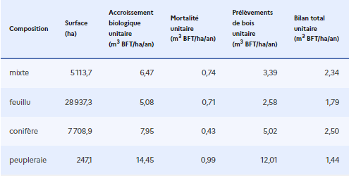

# 🌳 Spécificités - Forêts et Haies

## Forêts

Les spécificités des calculs pour les flux impliquant la biomasse en forêts sont déjà détaillés dans l'onglet [méthode générale](methode-generale.md). L'essentiel est synthétisé ici.&#x20;

Pour les changements d'occupation des sols, le calcul des flux de carbone engendrés par les réservoirs **Sols** et **Litière** est identique pour toutes les typologies. [Sources.](../introduction/sources.md#flux-de-carbone-du-sol-par-changement-doccupation-des-sols)

La particularité pour la typologie _Forêts_ réside dans le calcul des flux de carbone engendrés par le réservoir **Biomasse** des forêts. Ces flux peuvent avoir 3 sources différentes :

#### Déboisement&#x20;

Lorsque la surface forestière diminue, par changement d'occupation du sol (**déboisement, déforestation**), le déstockage engendré est calculé de la même manière que pour les autres typologies : ALDO applique la différence entre le stock de référence de la typologie initiale et de la typologie finale (réservoir biomasse). Ce flux (émission) est considéré instantané. [Sources.](../introduction/sources.md#flux-de-carbone-de-la-biomasse-en-forets-par-changement-doccupation-des-sols)

[Réservoir](../introduction/definitions.md#reservoirs) ALDO -> Biomasse

#### Boisement

Lorsque la surface forestière augmente, par changement d'occupation du sol **(boisement, afforestation)**, il est nécessaire de prendre en compte les flux engendrés par cette biomasse nouvellement implantée. Or la surface de cette typologie finale est déjà prise en compte ci-dessous. Pour ne pas faire de double-comptes sur les flux de carbone liés à l'accroissement biologique des végétaux, ils ne sont pas recalculés ici. [Sources.](../introduction/sources.md#flux-de-carbone-de-la-biomasse-en-forets-par-changement-doccupation-des-sols)

[Réservoir](../introduction/definitions.md#reservoirs) ALDO -> Biomasse

#### Accroissement net des végétaux

Si la surface augmente ou reste constante, des flux de carbone ont lieux dans les forêts, générés par l’accroissement biologique des forêts, auquel on retranche la mortalité des végétaux et les prélèvements de bois. Il s'agit de quantifier l'augmentation nette de la biomasse vivante (aérienne et racinaire). [Sources.](../introduction/sources.md#flux-de-carbone-de-la-biomasse-en-forets-par-accroissement-net)

[Réservoir](../introduction/definitions.md#reservoirs) ALDO -> Biomasse

Le Bilan total unitaire (m3 BFT/ha/an) est calculé en mètre cube "BFT" : bois fort tige (volume du tronc de l'arbre).&#x20;

<figure><figcaption>
Le bilan total unitaire est calculé en soustrayant à l’accroissement biologique des forêts la mortalité et les prélèvements de bois.
</figcaption></figure>

Ensuite, la conversion du bilan en (m3 BFT/ha/an) au **bilan en (tCO2e/ha/an)** est réalisée en appliquant quatre coefficients de conversion successifs :&#x20;

* Coefficients d'expansion des branches et des racines (du volume bois fort tige au volume total aérien et racinaire)
* Infradensité du bois (du volume total aérien et racinaire à tonne sèche de biomasse)
* Concentration en carbone (de tonne sèche de biomasse à tC)
* Coefficient de conversion de tC à tCO2e = 44/12

\---

Pour calculer les flux totaux de ce réservoir par composition forestière sur le territoire, nous multiplions chaque facteur de référence par la surface de chaque composition forestière sur le territoire (ha) - voir la [méthode générale](methode-generale.md). Alors, les flux totaux du réservoir biomasse en forêts tiennent compte des changements d'occupation des sols impliquant au moins à l'état initial ou final l'occupation forestière. Il n'est pas possible ici de connaître la part du flux total attribuée à chaque changement d'affectation des sols impliquant la forêt.

## Haies

A noter qu'il n'y a pas de calcul du flux dans les haies (contrairement aux stocks [specificites-haies.md](../stocks/specificites-haies.md "mention")), du fait de l'absence de données sur l'évolution du linéaire de haie en France. Si ces données surfaciques sur l'évolution du linéaire de haies sont connues sur votre territoire d'étude, vous pouvez les ajouter dans la rubrique [pratiques agricoles](../pratiques-agricoles/pratiques-agricoles.md#5-haies-sur-cultures-60-metres-lineaires-par-ha-ou-sur-prairies-prairies-100-metres-lineaires-par-ha) pour une prise en compte dans votre diagnostic ALDO.
