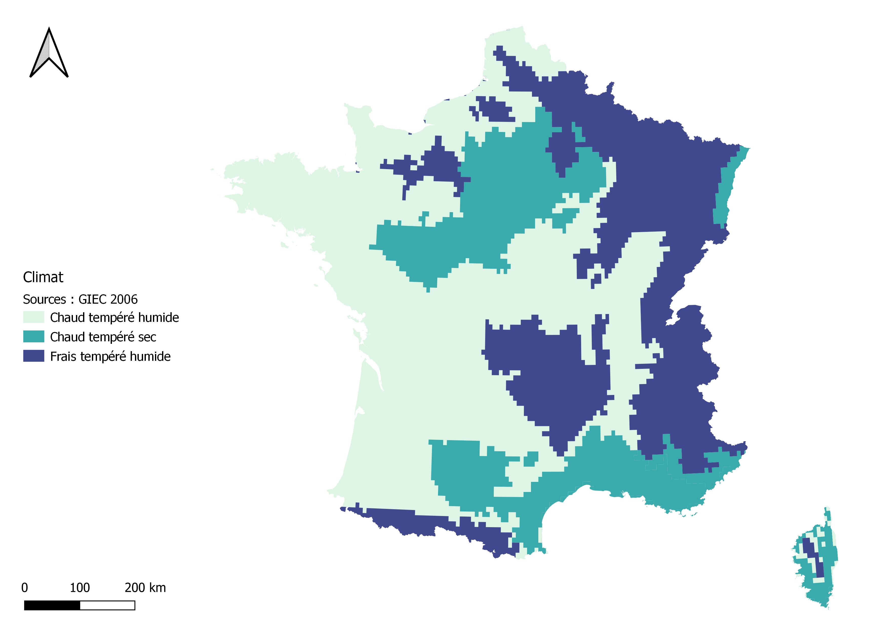
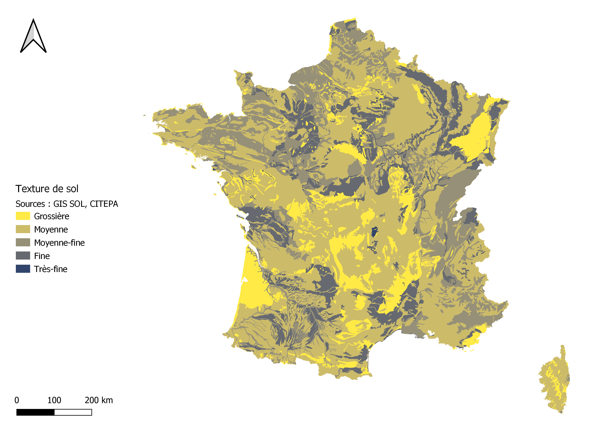
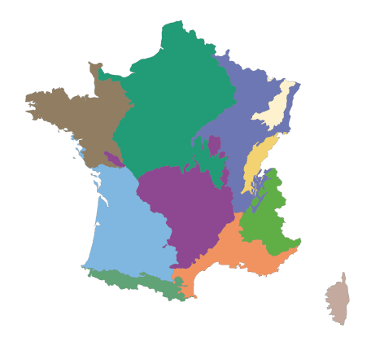
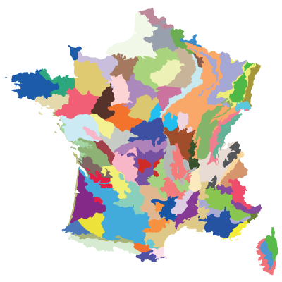

# ®️ Sources

## Maillage administratif

Maillage administratif

Le maillage administratif utilisé dans ALDO est le millésime communal officiel du 17 décembre 2018 fournit par l'IGN :&#x20;

Le fichier _IGN ADMIN EXPRESS® 17122018_ est disponible au téléchargement pour que chaque territoire puisse vérifier la liste de ses communes :



## Surfaces (ha)

Données surfaciques par occupation du sol

Corine Land Cover (CLC) est un inventaire biophysique de l’occupation des sols et de son évolution selon une nomenclature en 44 postes. Cet inventaire est produit par interprétation visuelle d'images satellite. CLC permet de cartographier des unités homogènes d’occupation des sols d’une surface minimale de 25 ha. Les millésimes 1990, 2000, 2006, 2012 et 2018 ont été réalisés.

ALDO propose les données surfaciques issues de Corine Land Cover, 2018.

Plusieurs compléments importants :

* Il est possible de remplacer cet inventaire de l'occupation du sol par des données plus fines de bases de données locales ou régionales, dans l'onglet [configuration](../configuration/configuration-manuelle.md#mises-a-jour-des-surfaces-doccupation-du-sol).
* Corine Land Cover est utilisée pour les surfaces de chaque typologie d'occupation du sol utilisée dans ALDO, sauf pour les Forêts et Haies. Voir ci-dessous.
* L'affectation entre la nomenclature ALDO et les typologies de Corine Land Cover est expliqué [ici](definitions.md#typologies-doccupation-du-sol). La répartition des sous-catégories de sols artificiels est propre à ALDO et est expliqué [ici.](../configuration/configuration-manuelle.md#hypotheses-de-repartition-des-surfaces-des-sols-artificialises)

Données surfaciques pour l'occupation du sol "Forêts"

La BD Forêt® de l'IGN (Institut national de l'information géographique et forestière) est un référentiel géographique forestier nomenclature nationale de 32 postes. Cet inventaire est réalisé par photo-interprétation d’images en infrarouge couleurs de la BD ORTHO®. Elle attribue à chaque plage cartographiée de plus de 0,5 ha un type de formation végétale.&#x20;

Il y a donc un gain de précision important par rapport aux données surfaciques des forêts de Corine Land Cover.

ALDO propose les données surfaciques issues de la BD Forêt® V2, 2018. Les surfaces sont exprimées par composition selon le type de peuplement (feuillus, mixtes, conifères ou peupleraies)

Il est possible de remplacer cet inventaire de l'occupation du sol par des données plus fines de bases de données locales ou régionales, dans l'onglet [configuration](../configuration/configuration-manuelle.md#mises-a-jour-des-surfaces-doccupation-du-sol).

Données surfaciques pour l'occupation du sol "Haies"

La typologie Haies n'existe pas dans Corine Land Cover. Des données complémentaires sont donc utilisées :

* Dans les versions précédentes d'ALDO, les surfaces de haies étaient issues d'un croisement des données du Référentiel Parcellaire Graphique 2018 et de la couche végétation de la BD TOPO® de l'IGN par l'Observatoire du Développement Rural de l'INRA (réalisée en 2018).
* :new: **Important** : les données surfaciques pour l'occupation du sol "Haies" sont actualisées dans la version CHANTERELLE 2023 et remplacées par l'utilisation de la BD Haies® de l'IGN (Institut national de l'information géographique et forestière). La BD Haies® permet d'obtenir des linéaires (km) de haies. Les travaux d'adaptation de l'INRAE en 2022 permettent d'affecter ces linéaires pour chaque territoire et chaque occupation du sol CLC.&#x20;

Ces linéaires ne peuvent pas **s'ajouter** à la surface totale du territoire détectée par Corine Land Cover. On considère donc que ces haies sont implantées **sur** des surfaces déjà inclues dans l'occupation du sol CLC. C'est pourquoi on parle en général de "_Haies associées aux activités agricoles_".&#x20;

L'outil ALDO propose dans le menu déroulant associé aux Haies le détail d'implantation du _linéaire haies par typologie du sol (km)_. Plus d'explication dans la rubrique dédiée aux [spécificités des haies.](../stocks/specificites-haies.md)

## Variations de surfaces (ha/an)

Données de changement d'occupation du sol

Corine Land Cover (CLC), [décrit ci-dessus](sources.md#donnees-surfaciques-par-occupation-du-sol), fournit également l'inventaire des changement d'occupation du sol entre deux millésimes.

ALDO propose les données surfaciques des changements d'occupation du sol issus de Corine Land Cover, observés entre 2012 et 2018. Les autres millésimes ne sont pas consultables car ils nécessiteraient de prendre en compte [la dynamique du carbone dans les sols.](../complements/perimetre-et-limites.md#dynamique-du-carbone-des-sols)

Il est possible de remplacer cet inventaire par des données plus fines de bases de données locales ou régionales, en suivant les recommandations de l'onglet [configuration](../configuration/configuration-manuelle.md#mises-a-jour-des-surfaces-doccupation-du-sol).

A noter l'absence de données sur l'évolution du linéaire de haies en France. Si ces données surfaciques sur l'évolution du linéaire de haies sont connues sur votre territoire d'étude, vous pouvez les ajouter dans la rubrique [pratiques agricoles](../pratiques-agricoles/pratiques-agricoles.md#5-haies-sur-cultures-60-metres-lineaires-par-ha-ou-sur-prairies-prairies-100-metres-lineaires-par-ha) pour une prise en compte dans votre diagnostic ALDO.

[Occupation du sol](definitions.md#typologies-doccupation-du-sol) -> Toutes, hors haies

## Stocks de carbone de référence (tC/ha)

Stocks de carbone des sols

Les stocks de référence pour les sols sont issus de données du Réseau de Mesures de la Qualité des Sols (RMQS) du GIS-SOL entre 2001 et 2011 et calculés par occupation du sol et par grande région pédoclimatique.

Les cartes ci-dessous représentent les zones pédologiques et les zones climatiques de France, qui, une fois regroupées, fournissent les zones pédoclimatiques. En fonction de l'emplacement du territoire, les occupations du sol n'auront donc pas les mêmes stocks de référence à l'hectare.

Les zones pédoclimatiques sont définies selon les lignes directrices du GIEC en fonction de classes de texture et de climat, et en cohérence avec les travaux du CITEPA. La zone pédoclimatique majoritaire est affectée à chaque territoire conformément aux travaux du CITEPA.

Voici les différentes zones pédoclimatiques possibles utilisées dans ALDO :

1. Texture Grossière
   * Climat chaud tempéré humide
   * Climat chaud tempéré sec
   * Climat frais tempéré humide
2. Texture Moyenne
   * Climat chaud tempéré humide
   * Climat chaud tempéré sec
   * Climat frais tempéré humide
3. Texture Moyenne-fine
   * Climat chaud tempéré humide
   * Climat chaud tempéré sec
   * Climat frais tempéré humide
4. Texture Fine
   * Climat chaud tempéré humide
   * Climat chaud tempéré sec&#x20;
   * Climat frais tempéré humide
5.  Texture Très-fine

    * 5.1 Climat chaud tempéré humide
    * 5.3 Climat frais tempéré humide

[Réservoir](definitions.md#reservoirs) ALDO -> **Sol**

[Occupation du sol](definitions.md#typologies-doccupation-du-sol) -> Toutes, hors haies

<figure><figcaption>
Zones climatiques, source GIEC (2006)
</figcaption></figure>

 

<figure><figcaption>
Zones pédologiques, source GIS SOL (2001-2011) et CITEPA (2022)
</figcaption></figure>

Stocks de carbone de la litière

Les stocks de référence pour la litière sont issues d'une revue de la littérature :

* Stock moyens de carbone par ha de la litière - Compte rendu de l’Académie d’Agriculture de France – Vol. 85, n°6, 1999

Ces données sont utilisées comme une moyenne nationale. Seules les typologies "Forêts" contiennent le réservoir "Litière".

[Réservoir](definitions.md#reservoirs) ALDO -> Litière

[Occupation du sol](definitions.md#typologies-doccupation-du-sol) -> Forêts

Stocks de carbone de la biomasse, hors forêts et haies

Les stocks de référence pour la biomasse (hors forêts, hors haies) sont issues d'une revue de la littérature :&#x20;

* IFN/FCBA/SOLAGRO – Biomasse forestière, populicole et bocagère disponible pour l'énergie à l'horizon 2020, Novembre 2009

Ces données sont obtenues par inter-régions. Elles sont utilisées pour les typologies de biomasse hors haies et forêts à savoir : vignes, vergers, prairies arbustives, prairies arborées, sols artificiels arbustifs, sols artificiels arborés.

[Réservoir](definitions.md#reservoirs) ALDO -> **Biomasse**

[Occupation du sol](definitions.md#typologies-doccupation-du-sol) -> Toutes, hors forêts et haies

Stocks de carbone de la biomasse des forêts

Les stocks de référence à l’hectare de la biomasse en forêt sont issus de l’inventaire forestier de l’IGN mené entre 2016 et 2020 et calculés par typologie de forêt et par sylvo- écorégion et grande région écologique.

Les données **de biomasse sur pied (vivante) et de bois mort** sont obtenues, à l'hectare, par composition (feuillu, conifère, mixte, peupleraie). Ces données sont exprimées par groupement de sylvo- écorégion (SER) lorsque les données sont statistiquement significatives, ou, dans le cas contraire, par Grande Région Ecologique (GRECO).

Les SER sont des subdivisions des GRECO, comme le montre les cartographies ci-dessous.

[Réservoir](definitions.md#reservoirs) ALDO -> Biomasse

[Occupation du sol](definitions.md#typologies-doccupation-du-sol) -> Forêts

<figure><figcaption>
GRECO, Source : Inventaire Forestier, IGN
</figcaption></figure>

 

<figure><figcaption>
SER, Source : Inventaire Forestier, IGN
</figcaption></figure>

Stocks de carbone de la biomasse des haies

:new: **Important** : La BD Haies® de l'IGN (Institut national de l'information géographique et forestière) permet d'obtenir des linéaires (km) de haies. Les travaux d'adaptation de l'INRAE en 2022 permettent d'affecter ces linéaires pour chaque territoire et chaque occupation du sol CLC.&#x20;

Ces linéaires sont affectés au stock de référence de biomasse aérienne et racinaire (tC/km) par département, répertorié par l'étude [_Stocks de bois et de carbone dans les haies bocagères françaises_](https://librairie.ademe.fr/changement-climatique-et-energie/5388-stocks-de-bois-et-de-carbone-dans-les-haies-bocageres-francaises.html) publiée par l'IGN en février 2022. L'étude couvre 31 départements bocagers.&#x20;

Pour les départements non couverts, une valeur moyenne nationale est affectée par défaut (101 tC/km).

:new: <mark style="color:yellow;">Une extension de l'étude sur les départements restants est en projet pour 2024.</mark>

[Réservoir](definitions.md#reservoirs) ALDO -> Biomasse

[Occupation du sol](definitions.md#typologies-doccupation-du-sol) -> Haies

## Flux de carbone de référence (tCO2e/ha/an)

Flux de carbone du sol, par changement d'occupation des sols

Lors d'un changement d'occupation du sol, il s'agit théoriquement d'affecter à la [surface concernée](sources.md#donnees-de-changement-doccupation-du-sol), la différence entre les [stocks de référence](sources.md#stocks-de-carbone-de-reference-tc-ha) (données RMQS du GIS SOL) de chacune des deux typologies d'occupation du sol. C'est le cas lors de l'atteinte rapide de l'équilibre de carbone du sol à l'état final, par exemple l'artificialisation du sol : le flux de référence appliqué sur l'année considérée est égal au stock final - stock initial.

Cependant, les dynamiques de stockage et de déstockage de carbone sont asymétriques. Selon les travaux d'Arrouays et al. 2002, les sols déstockent beaucoup plus vite qu'ils ne stockent. Plus d'explications dans la [méthode de calcul.](../flux/methode-generale.md)

ALDO propose ainsi des flux de référence déterminés à partir d'un **traitement ADEME** des stocks de référence (exprimés par occupation du sol et par zone pédoclimatique) selon la méthode de calcul développée par l'INRA dans Arrouays et al. 2002.

Source : Arrouays et al. Stocker du carbone dans les sols agricoles de France (2002) & traitement ADEME (Thomas Eglin, 2018)

[Réservoir](definitions.md#reservoirs) ALDO -> Sols

[Occupation du sol](definitions.md#typologies-doccupation-du-sol) -> Toutes, hors haies

Flux de carbone de la litière, par changement d'occupation des sols

Les flux de référence pour la litière sont issues d'une revue de la littérature, présentée ci-dessus ([stock de référence de la litière](sources.md#stocks-de-carbone-de-la-litiere)).

Ces données sont utilisées comme une moyenne nationale.&#x20;

Pour rappel, seules les typologies "Forêts" contiennent le réservoir "Litière". Les flux sont considérés instantanés, conformément à la méthode de calcul du CITEPA (guide OMINEA, 2017).

[Réservoir](definitions.md#reservoirs) ALDO -> Litière

[Occupation du sol](definitions.md#typologies-doccupation-du-sol) -> Forêts

Flux de carbone de la biomasse hors forêts, par changement d'occupation des sols

Les flux de référence pour la biomasse aérienne et racinaire des typologies d'occupation du sol hors forêts, sont issues d'une revue de la littérature, présentée ci-dessus ([stock de référence de la biomasse hors forêts)](sources.md#stocks-de-carbone-de-la-biomasse-hors-forets-et-haies).

Ces données sont exprimées par inter-régions (nord-est, nord-ouest, centre-est, sud-est et sud-ouest).&#x20;

En cas de séquestration supplémentaire (captation), la différence de stock de référence (de la biomasse) entre la typologie initiale et finale est divisé par 20 ans pour avoir un flux annuel, conformément à la méthode de calcul du CITEPA (guide OMINEA, 2017).

En cas de perte, selon cette même méthode de calcul, le flux est considéré instantané.

[Réservoir](definitions.md#reservoirs) ALDO -> Biomasse

[Occupation du sol](definitions.md#typologies-doccupation-du-sol) -> Toutes, hors forêts et haies

Flux de carbone de la biomasse en forêts, par changement d'occupation des sols

Si le changement d'occupation du sol aboutit à une augmentation de la surface forestière (afforestation), le flux de référence associé à cette surface[ est déjà pris en compte](sources.md#flux-de-carbone-de-la-biomasse-en-forets-par-accroissement-net) ci-dessous.

Si le changement d'occupation du sol aboutit à une perte de surface forestière (déboisement, déforestation), le déstockage engendré est calculé de la manière suivante : ALDO applique la différence entre le stock de référence de la typologie initiale et de la typologie finale (réservoir biomasse). Ce flux (émission) est considéré instantané.

[Réservoir](definitions.md#reservoirs) ALDO -> Biomasse

[Occupation du sol](definitions.md#typologies-doccupation-du-sol) -> Forêts

Flux de carbone de la biomasse en forêts, par accroissement biologique net

Des flux de carbone ont lieux dans les forêts, même à surface constante : il est ici question du bilan calculé en soustrayant à l’accroissement biologique des forêts, la mortalité et les prélèvements de bois.

Ces flux de carbone de la biomasse vivante (aérienne et racinaire) sont issus de l'inventaire forestier de l'IGN, [décrit ci-dessus.](sources.md#stocks-de-carbone-de-la-biomasse-des-forets)

Les nouvelles campagnes de mesures, menées entre 2016 et 2020 permettent d'obtenir des flux de référence de la biomasse en forêts à partir du bilan entre **les données d’accroissement biologique, de mortalité et de prélèvement.**

Comme pour les stocks, ces données sont obtenues, à l'hectare, par composition (feuillu, conifère, mixte, peupleraie) et sont calculées par groupement de sylvo- écorégion (SER) lorsque les données sont statistiquement significatives, ou, dans le cas contraire, par Grande Région Ecologique (GRECO).

[Réservoir](definitions.md#reservoirs) ALDO -> Biomasse

[Occupation du sol](definitions.md#typologies-doccupation-du-sol) -> Forêts

## Produits bois : stocks et flux

Stocks de carbone français dans les produits bois

Ces données proviennent de l'inventaire national d'émissions de GES réalisé par le CITEPA. L'édition utilisée est l'inventaire publié au printemps 2021 (couvrant la période 1990-2019).

:new: <mark style="color:yellow;">Ces chiffres seront annulés et remplacés par toute nouvelle édition.</mark>

Plus précisément, il s'agit des résultats du sous-secteur "Produits Bois" au sein du secteur UTCATF.

Entre l'édition utilisée initialement dans ALDO et l'édition utilisée ici, la méthode de calcul des Produits Bois a évolué. Initialement, la méthode utilisait une fonction "gamma" pour estimer l'évolution dans le temps des durées de vies des produits. Depuis, pour des raisons d'harmonisation européenne, la méthode utilise une cinétique d'ordre 1 telle que préconisée par le GIEC. Par ailleurs, les données sources (notamment les données statistiques de production de sciages) ont aussi été en partie mise à jour par les services statistiques du ministère de l'Agriculture.

En savoir plus : Citepa, [rapport Ominea. ](https://www.citepa.org/fr/ominea/)

Les données obtenues sont l'estimation des **stocks** dans les produits bois BO (sciages) et BI (panneaux, papiers) sur le territoire de France Métropolitaine, exprimés en tC (moyenne 2016-2019)

Puits de carbone français dans les produits bois

Comme pour les [Stocks de carbone français dans les produits bois](sources.md#stocks-de-carbone-francais-dans-les-produits-bois), ces données proviennent de l'inventaire national d'émissions de GES réalisé par le CITEPA. L'édition utilisée est l'inventaire publié au printemps 2021 (couvrant la période 1990-2019).

Les données obtenues sont l'estimation des **flux** dans les produits bois BO (sciages) et BI (panneaux, papiers) sur le territoire de France Métropolitaine, exprimés en tCO2e (moyenne 2016-2019)

Prélèvements et récolte de bois en forêts

Comme décrit [ci-dessus](sources.md#flux-de-carbone-de-la-biomasse-en-forets-par-accroissement-net), l'inventaire forestier de l'IGN, par des campagnes de mesures, menées entre 2016 et 2020, fournit des données d’accroissement biologique, de mortalité **et de prélèvement.**

Ces données sont exprimées ici à l'hectare. Elles permettent d'estimer une récolte théorique locale en suivant [la méthode détaillée ici.](../stocks/specificites-produits-bois.md#estimation-theorique-des-quantites-de-produits-bois-recoltees-par-categorie-bo-bi-du-territoire-et-d)

Distribution de la récolte entre les différents usages du bois (BO/BI/BE)

L'AGRESTE fournit des valeurs moyennes annuelles 2016 - 2020 pour :&#x20;

* La récolte commercialisée de BO/BI/BE dans chacune des 13 régions administratives
* L'estimation de la récolte non commercialisée de BE à l'échelle de la France<mark style="color:green;">.</mark> La récolte non commercialisée de BE par région administrative est estimée par différence entre la récolte totale par région administrative calculée en soustrayant les pertes d’exploitation aux données de prélèvements moyens fournies par l'IGN et la récolte commercialisée par région administrative issue de la base de donnée AGRESTE.

La proportion de récolte BO/BI/BE par ancienne région administrative est ainsi calculée, et cette proportion est appliquée à la récolte théorique locale en suivant [la méthode détaillée ici](../stocks/specificites-produits-bois.md#estimation-theorique-des-quantites-de-produits-bois-recoltees-par-categorie-bo-bi-du-territoire-et-d).

## Autres

Emissions de N2O

IPCC, Lignes directrices pour les inventaires nationaux de gaz à effet de serre,  2006

Flux d'accroissement des stocks de carbone par des pratiques agricoles stockantes

L'outil ALDO propose une estimation des flux d'accroissement des stocks de carbone des sols et de la biomasse, par la mise en place de certaines pratiques, issue de la littérature :

* [Quelle contribution de l’agriculture française à la réduction des émissions de gaz à effet de serre ?](https://librairie.ademe.fr/changement-climatique-et-energie/3468-quelle-contribution-de-l-agriculture-francaise-a-la-reduction-des-emissions-de-gaz-a-effet-de-serre-.html) étude INRA (Pellerin et al. 2013)

Cette étude INRA "Quelle contribution de l’agriculture française à la réduction des émissions de gaz à effet de serre ?" identifie 10 pratiques clés et analyse leur potentiel d'accroissement des stocks de carbone en lien avec leur potentiel d'atténuation d'autres GES importants (émissions indirectes et induites) et leurs coûts techniques, entre autres.

Ces flux de référence pour les pratiques agricoles stockantes sont des valeurs moyennes nationales.

Ces pratique sont expliquées plus en détails dans [la rubrique dédiée.](../pratiques-agricoles/pratiques-agricoles.md)

## Export des résultats

Résultats stocks de carbone

Les données de sortie d'ALDO sont fournies en export sur [data.ademe.fr](https://data.ademe.fr/datasets?q=ALDO)

Cette base de données "stocks" présente pour chacune des communes métropolitaines françaises (millésime 2018) :

* Les surfaces d'occupation du sol (ha) selon la nomenclature ALDO
* Les stocks de référence unitaires (tC/ha) pour chaque typologie d'occupation du sol
* Les valeurs de stocks (tC) pour chaque typologie d'occupation du sol (et pour chaque commune).

Résultats flux de carbone

Les données de sortie d'ALDO sont fournies en export sur [data.ademe.fr](https://data.ademe.fr/datasets?q=ALDO)

Cette base de données "flux" est divisée en 3 fichiers distincts pour des raisons de poids. Elle présente pour chacune des communes métropolitaines françaises (millésime 2018) :

* flux1\_changements-surfaces : Les variations de surfaces d'occupation du sol (ha/an) selon la nomenclature ALDO, et les flux totaux (tCO2e/an) correspondants en multipliant ces variations (ha/an) avec les flux unitaires (fichier flux2).
* flux2\_unitaire-changements-surfaces : Les flux de référence unitaires (tCO2e/ha) pour chaque changement d'occupation du sol. Ils sont des delta entre le stock unitaire (tC/ha) des occupations initiales et finales (en tenant compte de la durée d'application de ces flux et de la conversion de tC en tCO2e)
* flux3\_accroissement-biomasse - produits bois: Les valeurs de surfaces (ha), de flux de référence unitaires (tCO2e/ha/an) et de flux totaux (tCO2e/an) pour chaque occupation du sol forestière (et pour chaque commune). Ainsi que les flux annuels de produits bois (bois d'œuvre et bois d'industrie) en tCO2e/an.

Important : la valeur de flux total de chaque commune est contenue dans flux1 (colonne M). Il s'agit de la somme des flux liés au changement de surfaces (flux1 et flux2) et des flux liés à l'accroissement de la biomasse (flux3) et aux produits bois (flux 3).

